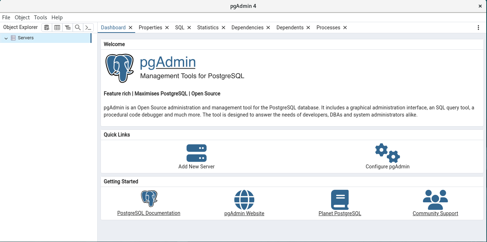
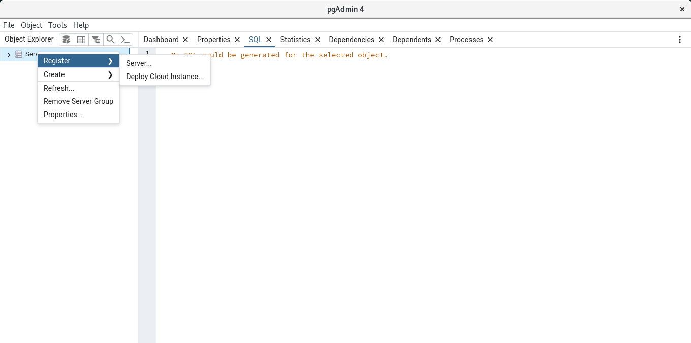
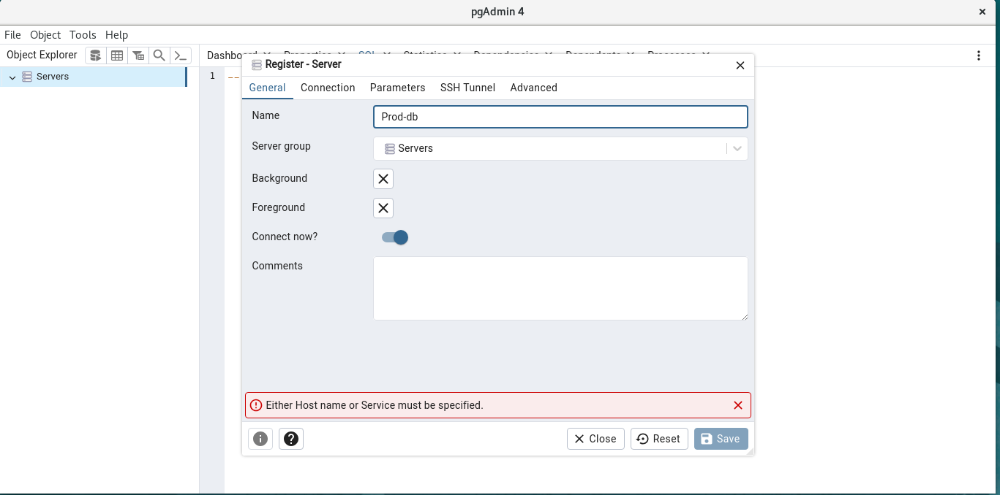
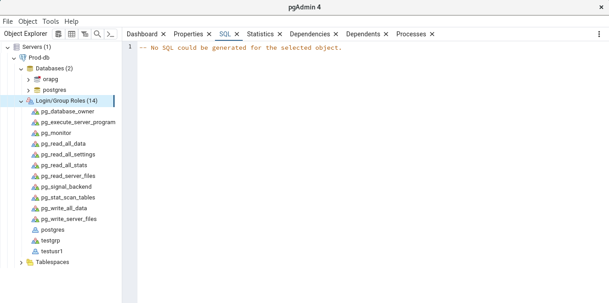
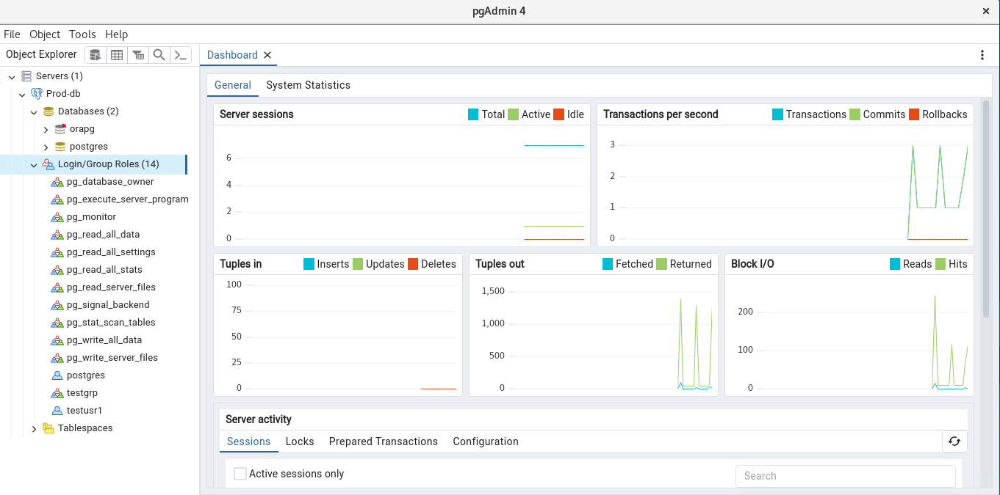

### PG ADMIN overview and installation:

PgAdmin4 is one of the robust open-source GUI tool designed for managing PostgreSQL database. It has user-friendly interface, which enables interaction with the database  without using complex command lines and making it suitable for beginners. 

We can down the [PGADMIN](https://www.pgadmin.org/download/) from its site. PgAdmin4 offers both desktop and web version. We will use web version.

As we are installing in Oracle Linux we will use compatible rpm and along with [rpm](https://www.pgadmin.org/download/pgadmin-4-rpm/) it has instructions too.

First we will setup the repository for this set of builds on Oracle Linux which is compatible to Redhat run:

```
[root@pgvm1 ~]# rpm -i https://ftp.postgresql.org/pub/pgadmin/pgadmin4/yum/pgadmin4-redhat-repo-2-1.noarch.rpm
        package pgadmin4-redhat-repo-2-1.noarch is already installed
[root@pgvm1 ~]#
```
Seems the repository is already installed in our system hence we will move to next for installing web version:
```
[root@pgvm1 ~]# sudo yum install pgadmin4-desktop
Last metadata expiration check: 2:18:23 ago on Thu 15 Feb 2024 03:59:25 PM +0545.
Dependencies resolved.
================================================================================
 Package                 Architecture  Version            Repository       Size
================================================================================
Installing:
 pgadmin4-desktop        x86_64        8.3-1.el8          pgAdmin4         96 M

Transaction Summary
================================================================================
Install  1 Package

Total download size: 96 M
Installed size: 366 M
Is this ok [y/N]: y
Downloading Packages:
pgadmin4-desktop-8.3-1.el8.x86_64.rpm           4.3 MB/s |  96 MB     00:22
--------------------------------------------------------------------------------
Total                                           4.3 MB/s |  96 MB     00:22
Running transaction check
Transaction check succeeded.
Running transaction test
Transaction test succeeded.
Running transaction
  Preparing        :                                                        1/1
  Installing       : pgadmin4-desktop-8.3-1.el8.x86_64                      1/1
  Running scriptlet: pgadmin4-desktop-8.3-1.el8.x86_64                      1/1
  Verifying        : pgadmin4-desktop-8.3-1.el8.x86_64                      1/1

Installed:
  pgadmin4-desktop-8.3-1.el8.x86_64

Complete!
[root@pgvm1 ~]#
```

Now lets start using it.

We can access the desktop version by simply searcing in application. There after we need to create and register the posgresql server as below:

Login Screen:
 

Next we need to register the postgresql Server:
 

There after another screen pops up where we need to provide name and connection credentials and hit save button (Parameters/SSH Tunnel/Advance we can left as it is) :
 

And in next screen the we can expand the server which we have added and we can see below:


It has multiple features, like we can monitor the server utiliztion, query the server and many more. But we will stop here as we can explore more as we go on.




 