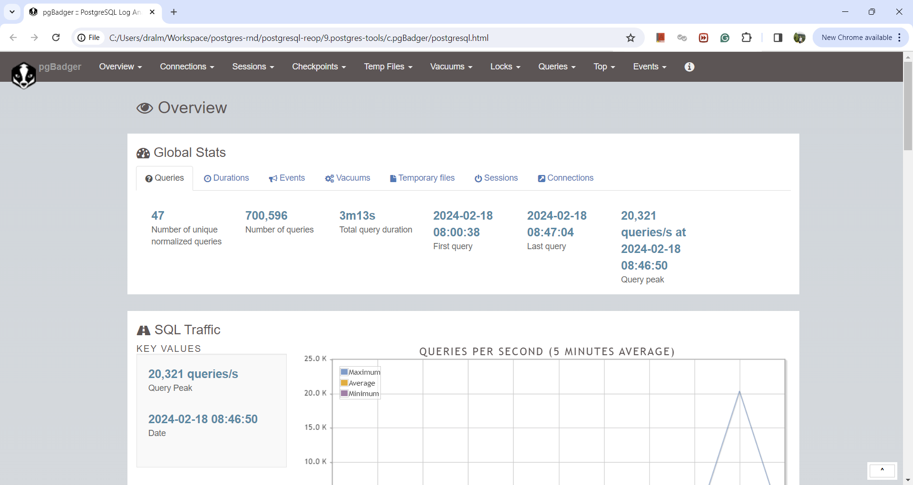

### pgBadger

pgBadger is a PostgreSQL performance analyzer, built for speed with fully detailed reports based on your PostgreSQL log files. pgBadger is a fast and easy tool to analyze your SQL traffic and create HTML5 reports with dynamics graphs. pgBadger is the perfect tool to understand the behavior of your PostgreSQL servers and identify which SQL queries need to be optimized.

#### Installation
We need to install it as it doesn't get shipped with PostgreSQL binaries. [pgBadger](https://yum.postgresql.org/packages/) is listed in postgresql common repository. Here we will be installing for rhel8 hence we will go for [RHEL8](https://download.postgresql.org/pub/repos/yum/common/redhat/rhel-8-x86_64/) repo.

Now lets install it:
```
[root@pgvm1 ~]# yum install https://download.postgresql.org/pub/repos/yum/common/redhat/rhel-8-x86_64/pgbadger-12.3-1PGDG.rhel8.noarch.rpm
PostgreSQL common RPMs for RHEL / Rocky 8 - x86_64  3.8 kB/s | 3.0 kB     00:00
PostgreSQL 15 for RHEL / Rocky 8 - x86_64           4.5 kB/s | 3.8 kB     00:00
PostgreSQL 14 for RHEL / Rocky 8 - x86_64           3.0 kB/s | 3.8 kB     00:01
pgbadger-12.3-1PGDG.rhel8.noarch.rpm                154 kB/s | 365 kB     00:02
Error:
 Problem: conflicting requests
  - nothing provides perl-Text-CSV_XS needed by pgbadger-12.3-1PGDG.rhel8.noarch from @commandline
(try to add '--skip-broken' to skip uninstallable packages or '--nobest' to use not only best candidate packages)
[root@pgvm1 ~]# 
```
Oops!!

Seems it has some dependencies hence lets fix those:
```
[root@pgvm1 ~]# cd /etc/yum.repos.d/
[root@pgvm1 yum.repos.d]# curl -k -O https://dl.fedoraproject.org/pub/epel/8/Everything/x86_64/Packages/p/perl-Text-CSV_XS-1.40-1.el8.x86_64.rpm
  % Total    % Received % Xferd  Average Speed   Time    Time     Time  Current
                                 Dload  Upload   Total   Spent    Left  Speed
100  145k  100  145k    0     0  50346      0  0:00:02  0:00:02 --:--:-- 50329
[root@pgvm1 yum.repos.d]# ls
docker-ce.repo         perl-Text-CSV_XS-1.40-1.el8.x86_64.rpm  pgdg-redhat-all.repo
oracle-linux-ol8.repo  pgadmin4.repo                           uek-ol8.repo
[root@pgvm1 yum.repos.d]# yum install perl-Text-CSV_XS-1.40-1.el8.x86_64.rpm
Last metadata expiration check: 0:02:47 ago on Thu 15 Feb 2024 07:02:17 PM +0545.
Error:
 Problem: conflicting requests
  - nothing provides perl(UNIVERSAL::isa) needed by perl-Text-CSV_XS-1.40-1.el8.x86_64 from @commandline
(try to add '--skip-broken' to skip uninstallable packages or '--nobest' to use not only best candidate packages)
[root@pgvm1 yum.repos.d]# curl -k -O https://dl.fedoraproject.org/pub/epel/8/Everything/x86_64/Packages/p/perl-UNIVERSAL-isa-1.20171012-4.el8.noarch.rpm
  % Total    % Received % Xferd  Average Speed   Time    Time     Time  Current
                                 Dload  Upload   Total   Spent    Left  Speed
100 24880  100 24880    0     0  16902      0  0:00:01  0:00:01 --:--:-- 16890
[root@pgvm1 yum.repos.d]# 
[root@pgvm1 yum.repos.d]# yum install perl-UNIVERSAL-isa-1.20171012-4.el8.noarch.rpm perl-Text-CSV_XS-1.40-1.el8.x86_64.rpm
Last metadata expiration check: 0:05:59 ago on Thu 15 Feb 2024 07:02:17 PM +0545.
Dependencies resolved.
====================================================================================
 Package                 Arch        Version                Repository         Size
====================================================================================
Installing:
 perl-Text-CSV_XS        x86_64      1.40-1.el8             @commandline      145 k
 perl-UNIVERSAL-isa      noarch      1.20171012-4.el8       @commandline       24 k

Transaction Summary
====================================================================================
Install  2 Packages

Total size: 170 k
Installed size: 332 k
Is this ok [y/N]: y
Downloading Packages:
Running transaction check
Transaction check succeeded.
Running transaction test
Transaction test succeeded.
Running transaction
  Preparing        :                                                            1/1
  Installing       : perl-UNIVERSAL-isa-1.20171012-4.el8.noarch                 1/2
  Installing       : perl-Text-CSV_XS-1.40-1.el8.x86_64                         2/2
  Running scriptlet: perl-Text-CSV_XS-1.40-1.el8.x86_64                         2/2
/sbin/ldconfig: /etc/ld.so.conf.d/kernel-5.4.17-2102.201.3.el8uek.x86_64.conf:6: hwcap directive ignored

  Verifying        : perl-UNIVERSAL-isa-1.20171012-4.el8.noarch                 1/2
  Verifying        : perl-Text-CSV_XS-1.40-1.el8.x86_64                         2/2

Installed:
  perl-Text-CSV_XS-1.40-1.el8.x86_64   perl-UNIVERSAL-isa-1.20171012-4.el8.noarch

Complete!
[root@pgvm1 yum.repos.d]#
```

Finally we were able to install it:
```
[root@pgvm1 yum.repos.d]# yum install https://download.postgresql.org/pub/repos/yum/common/redhat/rhel-8-x86_64/pgbadger-12.3-1PGDG.rhel8.noarch.rpm
Last metadata expiration check: 0:08:43 ago on Thu 15 Feb 2024 07:02:17 PM +0545.
pgbadger-12.3-1PGDG.rhel8.noarch.rpm                227 kB/s | 365 kB     00:01
Dependencies resolved.
====================================================================================
 Package         Architecture  Version                    Repository           Size
====================================================================================
Installing:
 pgbadger        noarch        12.3-1PGDG.rhel8           @commandline        365 k

Transaction Summary
====================================================================================
Install  1 Package

Total size: 365 k
Installed size: 1.6 M
Is this ok [y/N]: y
Downloading Packages:
Running transaction check
Transaction check succeeded.
Running transaction test
Transaction test succeeded.
Running transaction
  Preparing        :                                                            1/1
  Installing       : pgbadger-12.3-1PGDG.rhel8.noarch                           1/1
  Running scriptlet: pgbadger-12.3-1PGDG.rhel8.noarch                           1/1
  Verifying        : pgbadger-12.3-1PGDG.rhel8.noarch                           1/1

Installed:
  pgbadger-12.3-1PGDG.rhel8.noarch

Complete!
[root@pgvm1 yum.repos.d]#
```

#### Configuration
To use pgBadger effectively, logging in PostgreSQL should be set up to provide pgBadger as much information as possible. A handful of options can tweaked to allow the database system to log useful information for pgBadger to generate useful reports. Full documentation for PostgreSQL configuration can be found on the [pgBadger](https://pgbadger.darold.net/) documentation page, but some basic information is below.

We will have to adjust your PostgreSQL configuration file to give pgbadger the information it needs. When run, pgBadger will process the logs from PostgreSQL whether they are syslog, stderr, or csvlog, as long as the log lines themselves have enough information in the prefix.

Before adjusting the parameters lets note down the default values:
```
postgres=# show log_destination;
 log_destination
-----------------
 stderr
(1 row)

postgres=#
postgres=# show log_line_prefix;
 log_line_prefix
-----------------
 %m [%p]
(1 row)

postgres=#
postgres=# show log_statement;
 log_statement
---------------
 none
(1 row)

postgres=# show log_min_duration_statement;
 log_min_duration_statement
----------------------------
 -1
(1 row)

postgres=#
postgres=# show log_checkpoints;
 log_checkpoints
-----------------
 off
(1 row)

postgres=# show log_connections;
 log_connections
-----------------
 off
(1 row)

postgres=# show log_disconnections;
 log_disconnections
--------------------
 off
(1 row)

postgres=# show log_lock_waits;
 log_lock_waits
----------------
 off
(1 row)

postgres=# show log_temp_files;
 log_temp_files
----------------
 -1
(1 row)

postgres=# show log_autovacuum_min_duration;
 log_autovacuum_min_duration
-----------------------------
 -1
(1 row)

postgres=# 
```

Example log_line_prefix values:

If log_destination = 'syslog'
```log_line_prefix = 'user=%u,db=%d,app=%aclient=%h '```
If log_destination = 'stderr'
```
log_line_prefix = '%t [%p]: [%l-1] user=%u,db=%d,app=%a,client=%h '
```
Second you should enable the "log_min_duration_statement". This setting causes PostgreSQL to log all statements which run for longer than the given value in milliseconds, where a value of 0 will log everything. Make sure that the "log_statement" is set to "none", otherwise the "log_min_duration_statement" setting will not log anything ("none" is the default value anyway).
```
log_statement = 'none'
log_min_duration_statement = 0
```
Third you should enable logging of checkpoints, locks and more to get maximum value out of the log analysis:
```
log_checkpoints = on
log_connections = on
log_disconnections = on
log_lock_waits = on
log_temp_files = 0
log_autovacuum_min_duration = 0
```
Note that you do not need to restart PostgreSQL to make the changes take effect, simply log into the psql command line and invoke the following (the same way you run SQL statements):
```
postgres=# select pg_reload_conf();
 pg_reload_conf
----------------
 t
(1 row)

postgres=#
postgres=# show log_destination;
 log_destination
-----------------
 stderr
(1 row)

postgres=#
postgres=# show log_line_prefix;
                 log_line_prefix
-------------------------------------------------
 %t [%p]: [%l-1] user=%u,db=%d,app=%a,client=%h
(1 row)

postgres=#
postgres=# show log_statement;
 log_statement
---------------
 none
(1 row)

postgres=#
postgres=# show log_min_duration_statement;
 log_min_duration_statement
----------------------------
 0
(1 row)

postgres=#
postgres=# show log_checkpoints;
 log_checkpoints
-----------------
 on
(1 row)

postgres=#
postgres=# show log_connections;
 log_connections
-----------------
 on
(1 row)

postgres=#
postgres=# show log_disconnections;
 log_disconnections
--------------------
 on
(1 row)

postgres=#
postgres=# show log_lock_waits;
 log_lock_waits
----------------
 on
(1 row)

postgres=#
postgres=# show log_temp_files;
 log_temp_files
----------------
 0
(1 row)

postgres=#
postgres=# show log_autovacuum_min_duration;
 log_autovacuum_min_duration
-----------------------------
 0
(1 row)

postgres=#
```

Of course, logging all statements has a performance impact on your system, so you could enable it for enough time to give you between 50 and 200 Mb worth of logs, then disable it again.

We have run the pgbengh and then generated the pgBadger report as below:
```
[postgres@pgvm1 log]$ pgbadger --prefix '%t [%p]: [%l-1] user=%u,db=%d,app=%a,client=%h ' postgresql-Fri.log -o postgresql.html
[>                        ] Parsed         0 bytes of 131591663 (0.00%), queries: 0,[>                        ] Parsed      1503 bytes of 131591663 (0.00%), queries: 8,
[>                        ] Parsed      8843 bytes of 131591663 (0.01%), queries: 23[>                        ] Parsed    177816 bytes of 131591663 (0.14%), queries: 86
[>                        ] Parsed   1850664 bytes of 131591663 (1.41%), queries: 98[>                        ] Parsed   3719273 bytes of 131591663 (2.83%), queries: 19
[=>                       ] Parsed   5588860 bytes of 131591663 (4.25%), queries: 29[=>                       ] Parsed   7458663 bytes of 131591663 (5.67%), queries: 39
[=>                       ] Parsed   9327775 bytes of 131591663 (7.09%), queries: 49[==>                      ] Parsed  11197485 bytes of 131591663 (8.51%), queries: 59
[==>                      ] Parsed  13066703 bytes of 131591663 (9.93%), queries: 69[==>                      ] Parsed  14936544 bytes of 131591663 (11.35%), queries: 7
[===>                     ] Parsed  16805856 bytes of 131591663 (12.77%), queries: 8[===>                     ] Parsed  18676184 bytes of 131591663 (14.19%), queries: 9
[===>                     ] Parsed  20554213 bytes of 131591663 (15.62%), queries: 1[====>                    ] Parsed  22433792 bytes of 131591663 (17.05%), queries: 1
[====>                    ] Parsed  24313585 bytes of 131591663 (18.48%), queries: 1[====>                    ] Parsed  26192884 bytes of 131591663 (19.90%), queries: 1
[=====>                   ] Parsed  28072655 bytes of 131591663 (21.33%), queries: 1[=====>                   ] Parsed  29952074 bytes of 131591663 (22.76%), queries: 1
[=====>                   ] Parsed  31831604 bytes of 131591663 (24.19%), queries: 1[======>                  ] Parsed  33711110 bytes of 131591663 (25.62%), queries: 1
[======>                  ] Parsed  35590609 bytes of 131591663 (27.05%), queries: 1[======>                  ] Parsed  37470438 bytes of 131591663 (28.47%), queries: 1
[=======>                 ] Parsed  39349930 bytes of 131591663 (29.90%), queries: 2[=======>                 ] Parsed  41229399 bytes of 131591663 (31.33%), queries: 2
[=======>                 ] Parsed  43108754 bytes of 131591663 (32.76%), queries: 2[========>                ] Parsed  44987994 bytes of 131591663 (34.19%), queries: 2
[========>                ] Parsed  46867478 bytes of 131591663 (35.62%), queries: 2[========>                ] Parsed  48747260 bytes of 131591663 (37.04%), queries: 2
[=========>               ] Parsed  50626966 bytes of 131591663 (38.47%), queries: 2[=========>               ] Parsed  52506765 bytes of 131591663 (39.90%), queries: 2
[=========>               ] Parsed  54386039 bytes of 131591663 (41.33%), queries: 2[==========>              ] Parsed  56265795 bytes of 131591663 (42.76%), queries: 2
[==========>              ] Parsed  58145140 bytes of 131591663 (44.19%), queries: 3[==========>              ] Parsed  60024889 bytes of 131591663 (45.61%), queries: 3
[===========>             ] Parsed  61903955 bytes of 131591663 (47.04%), queries: 3[===========>             ] Parsed  63783636 bytes of 131591663 (48.47%), queries: 3
[===========>             ] Parsed  65663103 bytes of 131591663 (49.90%), queries: 3[============>            ] Parsed  67542916 bytes of 131591663 (51.33%), queries: 3
[============>            ] Parsed  69422588 bytes of 131591663 (52.76%), queries: 3[=============>           ] Parsed  71302035 bytes of 131591663 (54.18%), queries: 3
[=============>           ] Parsed  73181801 bytes of 131591663 (55.61%), queries: 3[=============>           ] Parsed  75060852 bytes of 131591663 (57.04%), queries: 3
[==============>          ] Parsed  76940552 bytes of 131591663 (58.47%), queries: 4[==============>          ] Parsed  78820146 bytes of 131591663 (59.90%), queries: 4
[==============>          ] Parsed  80699735 bytes of 131591663 (61.33%), queries: 4[===============>         ] Parsed  82579021 bytes of 131591663 (62.75%), queries: 4
[===============>         ] Parsed  84459136 bytes of 131591663 (64.18%), queries: 4[===============>         ] Parsed  86338379 bytes of 131591663 (65.61%), queries: 4
[================>        ] Parsed  88218198 bytes of 131591663 (67.04%), queries: 4[================>        ] Parsed  90097618 bytes of 131591663 (68.47%), queries: 4
[================>        ] Parsed  91977252 bytes of 131591663 (69.90%), queries: 4[=================>       ] Parsed  93856500 bytes of 131591663 (71.32%), queries: 4
[=================>       ] Parsed  95736423 bytes of 131591663 (72.75%), queries: 5[=================>       ] Parsed  97615752 bytes of 131591663 (74.18%), queries: 5
[==================>      ] Parsed  99495284 bytes of 131591663 (75.61%), queries: 5[==================>      ] Parsed 101374960 bytes of 131591663 (77.04%), queries: 5
[==================>      ] Parsed 103254673 bytes of 131591663 (78.47%), queries: 5[===================>     ] Parsed 105133934 bytes of 131591663 (79.89%), queries: 5
[===================>     ] Parsed 107013647 bytes of 131591663 (81.32%), queries: 5[===================>     ] Parsed 108893019 bytes of 131591663 (82.75%), queries: 5
[====================>    ] Parsed 110772528 bytes of 131591663 (84.18%), queries: 5[====================>    ] Parsed 112649146 bytes of 131591663 (85.61%), queries: 5
[====================>    ] Parsed 114527038 bytes of 131591663 (87.03%), queries: 6[=====================>   ] Parsed 116406446 bytes of 131591663 (88.46%), queries: 6'
[=====================>   ] Parsed 118285847 bytes of 131591663 (89.89%), queries: 6[=====================>   ] Parsed 120165528 bytes of 131591663 (91.32%), queries: 6
[======================>  ] Parsed 122045031 bytes of 131591663 (92.75%), queries: 6[======================>  ] Parsed 123924726 bytes of 131591663 (94.17%), queries: 6
[======================>  ] Parsed 125804076 bytes of 131591663 (95.60%), queries: 6[=======================> ] Parsed 127683525 bytes of 131591663 (97.03%), queries: 6
[=======================> ] Parsed 129563010 bytes of 131591663 (98.46%), queries: 6[=======================> ] Parsed 131442792 bytes of 131591663 (99.89%), queries: 6
[========================>] Parsed 131591663 bytes of 131591663 (100.00%), queries: 700596, events: 0
LOG: Ok, generating html report...
[postgres@pgvm1 log]$

```
The above command creates a html report, which we can review for possible regression and overall status of the database.
